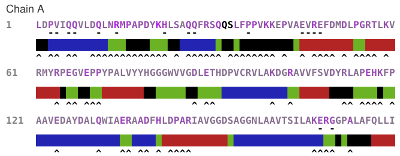

proseqjs is a javascript canvas library for visualising protein sequences.

It currently supports visualising the following:

* Molecular accessible surface area;
* Secondary structure;
* Symmetry contacts;
* Solvent accessibility.

# Screenshot

# Install

## Bower

    bower install proseqjs --save
